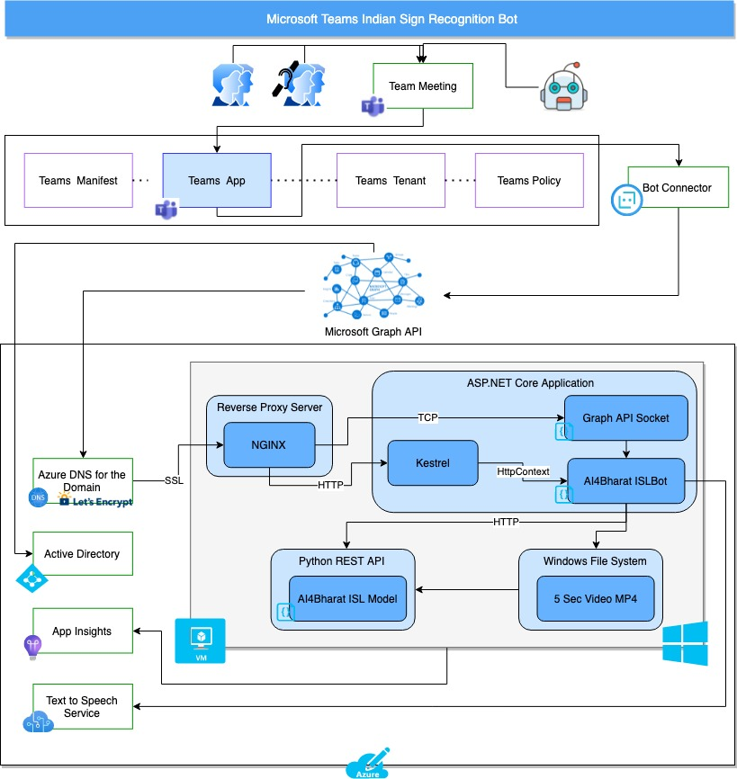
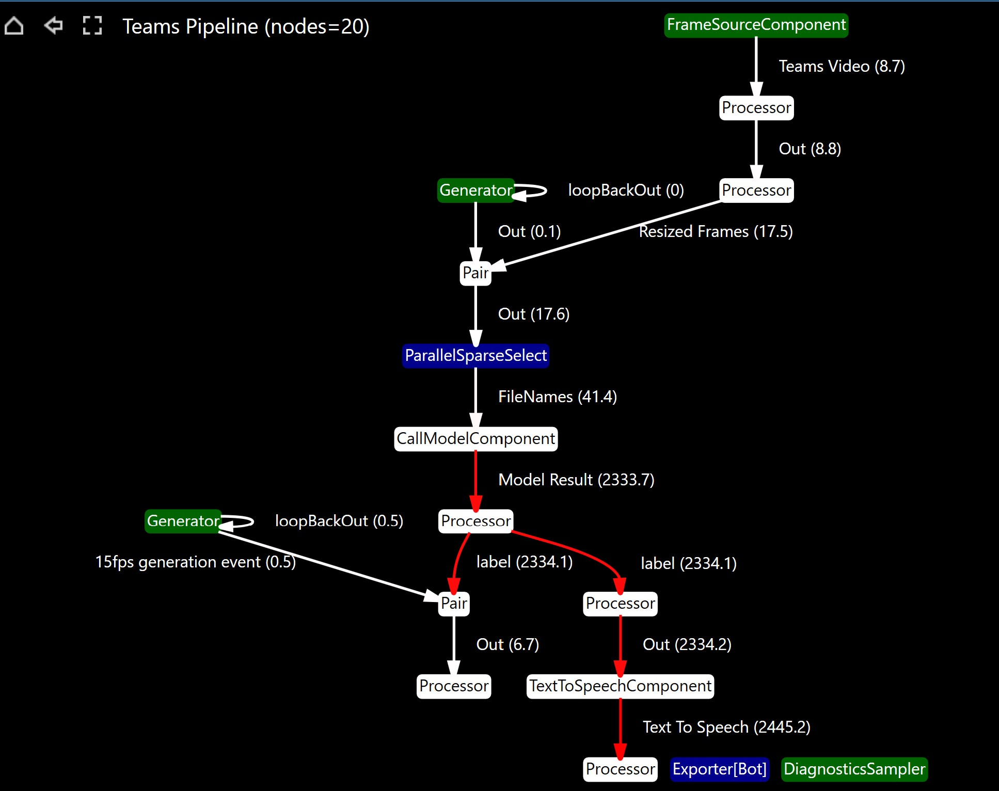

# AI4Bharat Indian Sign Language Bot for Microsoft Teams

An experimental integration of [INCLUDE models](https://github.com/AI4Bharat/INCLUDE) for Indian Sign-Language Recognition with Microsoft Teams Video Meetings.  

Currently supports only Word-Level SLR, with only one signer in the meet.

## Bot Architecture

## Bot Teams Pipeline

## Documentation

### Develop

1. [Develops and Debug Bot locally](debug.md)

### Deploy & Test

1. [Deploy and Test the Bot](deploy.md)
