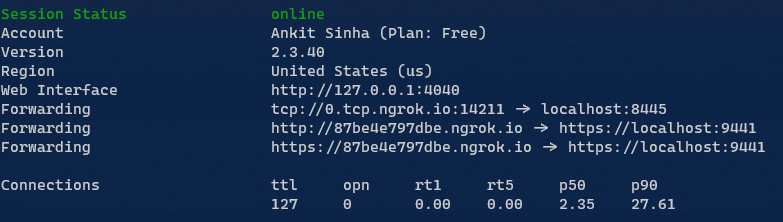

# Run and Debug Bot locally

In our scenario we will have a Virtual Machine running a bot where the bot belongs to a specific domain which is configured to work with Microsoft Teams.
So that we can debug your bot code locally you will require configuration on your local machine and some pointers at the domain.


## Pre-requisites for debugging bot locally

1. Installed Certificate
  - You need to have a wildcard SSL certificate for the domain (like *.mybot.com). 
  - **Note:** An SSL certificate can be found in the Key Vault. Download it as a PFX file into the local machine (do not put a value in the password field)
  - This certificate must be installed in your system certificate manager.
2. Ngrok Account
  - Signup for [ngrok free account](ngrok.com) or login and get auth token.

## Steps to debug

### Setup and run Ngrok
1.	Have the following ngrok configuration in file.
    
    ```yaml
    authtoken: YOUR_TOKEN
    tunnels:
        signaling:
            addr: https://localhost:9441
            proto: http
        media:
            addr: 8445
            proto: tcp
    ```

1.  Run ngrok using `ngrok start --all`.


1.	Note down the following thing from ngrok output  
    - http forwarding url (something.ngrok.io) 
    - tcp forwarding address (0.tcp.ngrok.io) and 
    - its port 14211.  

### Set up a cname 

Youll need an alias from a public domain that Microsoft teams sees to a local domain.
One way to do this is to have a domain and a CNAME that points ot the TCP tunnel running locally.
Azure DNS provides hosting for a domain.

Steps

1. Setup a CNAME that points to the *tcp* address of ngrok. Ngrok tcp are usually `0.tcp...` `1.tcp...` `2.tcp...` etc. If you only have one subdomain mapped to `x.tcp` and if ngrok did not assign a `x.tcp` address then just re-run it till it does. What we need from here is the port number.
2. Add the CNAME
### Setup Application Settings

1. Below are the changes for `appsettings.json`. 
    - Update to the `ServiceCname` the ngrok http address (above) 
    - Update the `InstancePublicPort` to ngrok tcp assigned port (above). 
    - `MediaServiceFQDN` is the subdomain URL that is forwared to tcp URL assigned by ngrok (`local.mybot.com` is forwarded to `0.tcp.ngrok.io`).
    - `CertificateThumbprint` should either be wildcard certificate (from above) or certificate for subdomain you are forwarding from, in this case it’s `*.mybot.com`. If you are using more nested sub domain for CNAME forwarding to ngrok tcp then the certificate should be for 1 domain higher than the nest depth. For example, if your CNAME entry is `0.local.mybot.com` then you need certificate for `*.local.mybot.com`. Having a certificate for `*.mybot.com` does not work.
    ```yaml
    "AzureSettings": {
        "BotName": "BOT_NAME",
        "AadAppId": " APP_ID",
        "AadAppSecret": "APP_SECRET",
        "ServiceCname": "87be4e797dbe.ngrok.io",
        "MediaServiceFQDN": "local.mybot.com",
        "ServiceDnsName": "",
        "CertificateThumbprint": "CERTIFICATE_THUMBPRINT",
        "InstancePublicPort": 14211,
        "CallSignalingPort": 9441,
        "InstanceInternalPort": 8445,
        "PlaceCallEndpointUrl": https://graph.microsoft.com/v1.0
     }
    ```
1.	Run the project - make sure you have the startup as the AI4Bharat.ISLBot.Services (run in Kestrel not IIS Express) 